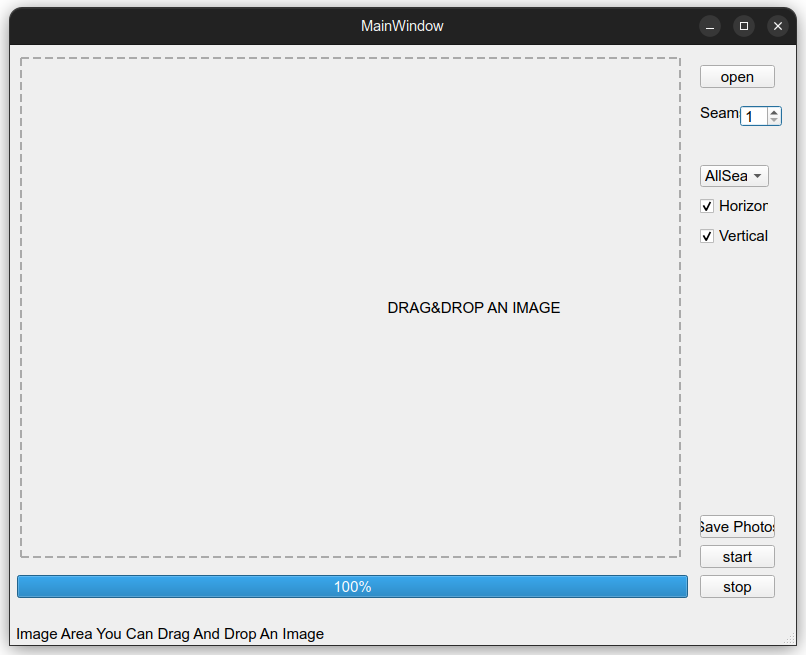
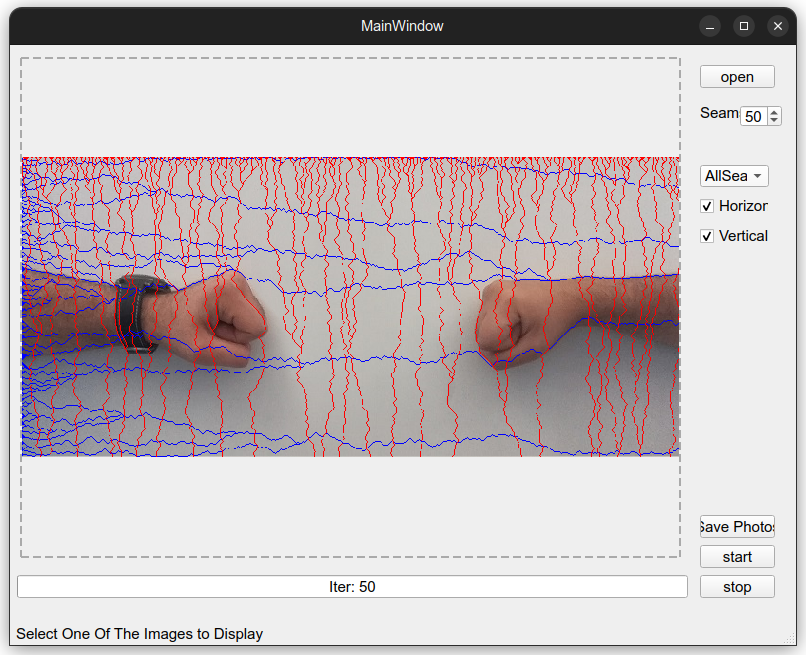
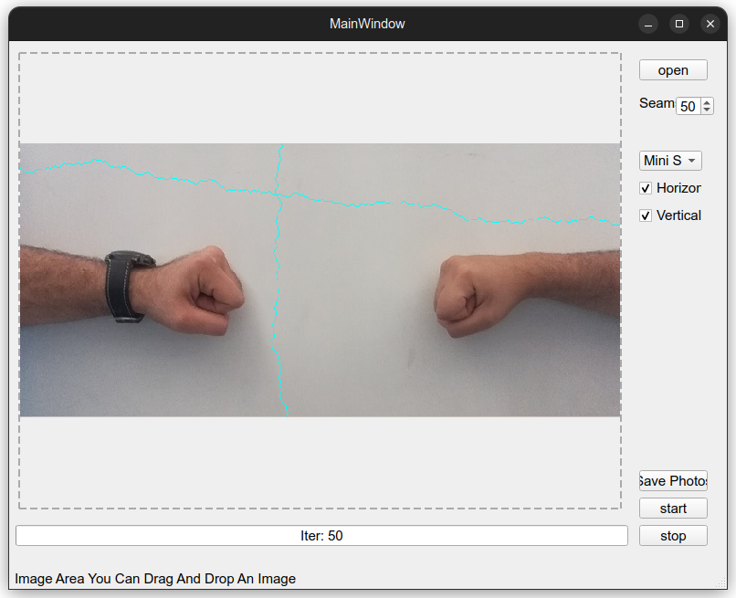
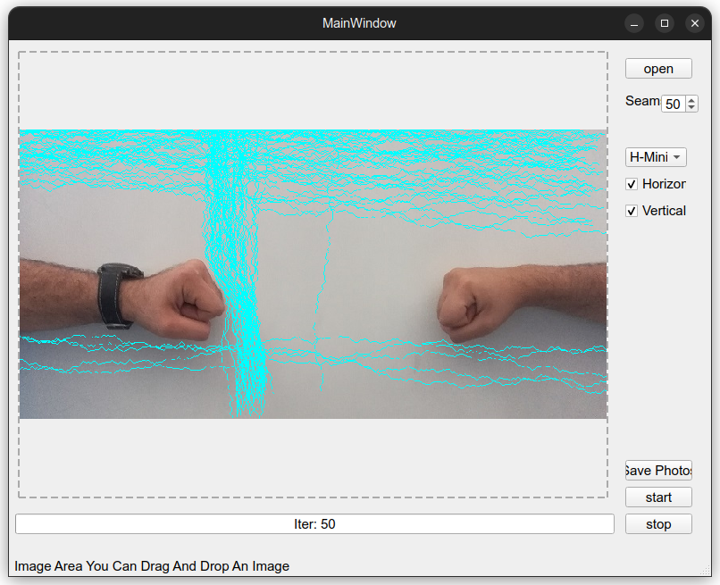
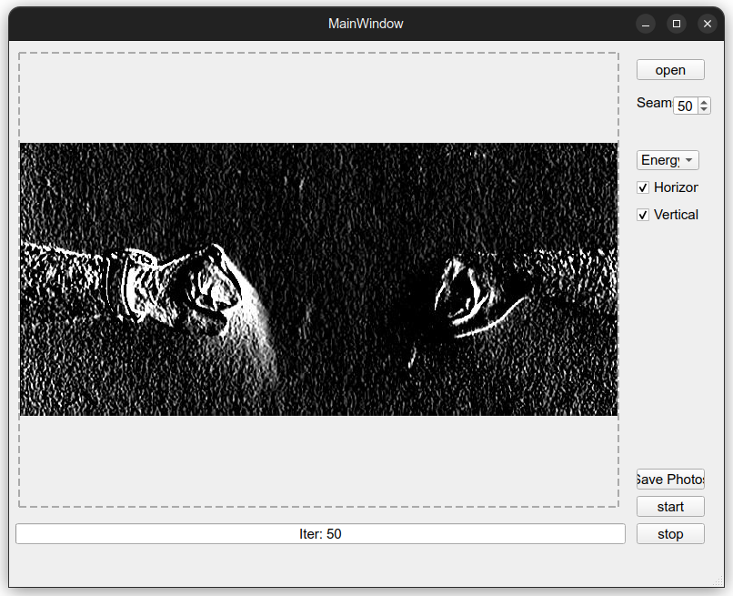

# Seam Carving Algorithm
___
### Apply Seam Carving Algorithm In Pure Python With Ability To Compare Two Images(Before\After), Show Seams,Minimum Seam, History of Removed Seams, Energy Map and Save the Result Images.
### Choose Number of Seams and Which Kind (Vertical\Horizontal\both) of Seams You want to Extract.
### You can just drag&drop files to start.
___
### Technologies
#### Project is created with:
* python version: 3.8
* numpy version: 1.21.2
* opencv-python version: 4.5.4.60
* pyqt5-plugins: 5.15.4.2.2
* PyQt5-Qt5: 5.15.2
* PyQt5-sip: 12.9.0
* pyqt5-tools: 5.15.4.3.2
___
### Screenshots
#### Main Window

#### All Seams in Last Iteration

#### Minimum Seam\s In Last Iteration

#### All Seams That Have Been Removed 

#### Energy Map for Image 

